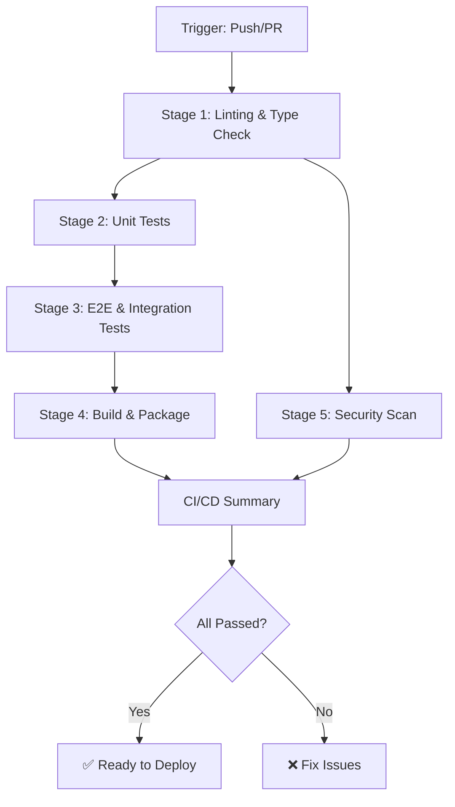

# CI/CD Pipeline Documentation
# UNS-ClaudeJP 6.0.0


---

## Quick Links

| Document | Description |
|----------|-------------|
| **[SETUP_CICD.md](SETUP_CICD.md)** | 5-minute quick start guide |
| **[../CI_CD_IMPLEMENTATION.md](../CI_CD_IMPLEMENTATION.md)** | Complete implementation documentation |
| **[matrix-config.json](workflows/matrix-config.json)** | Matrix testing configuration |
| **[secrets.template.env](secrets.template.env)** | GitHub secrets template |
| **[../.pre-commit-config.yaml](../.pre-commit-config.yaml)** | Pre-commit hooks configuration |

---

## Pipeline Overview

The UNS-ClaudeJP CI/CD pipeline is a comprehensive, multi-stage automated workflow that ensures code quality, security, and reliability across the full-stack application.

### Key Metrics

| Metric | Value |
|--------|-------|
| **Pipeline Stages** | 5 core + 1 optional (matrix testing) |
| **Average Duration** | 15-20 minutes |
| **Test Coverage Target** | 90% (minimum 80%) |
| **Parallel Jobs** | Up to 10 concurrent |
| **Supported Platforms** | Ubuntu, Windows, macOS |
| **Node.js Versions** | 18, 20, 22 |
| **Python Versions** | 3.11, 3.12 |

---

## Pipeline Stages



### Stage Details

#### 1️⃣ Linting & Type Check (Parallel)
**Duration:** ~5 minutes  
**Runs on:** Every push, every PR

- **Frontend:**
  - ESLint (0 warnings policy)
  - TypeScript type checking
  - Prettier formatting check

- **Backend:**
  - Black code formatting
  - isort import ordering
  - MyPy type checking

#### 2️⃣ Unit Tests (Parallel)
**Duration:** ~8 minutes  
**Runs on:** Every push, every PR

- **Frontend:**
  - Vitest unit tests
  - Component tests
  - Coverage reporting (target: 90%)

- **Backend:**
  - pytest unit tests
  - Service layer tests
  - Coverage reporting (target: 90%)

#### 3️⃣ E2E & Integration Tests (Sequential)
**Duration:** ~12 minutes  
**Runs on:** Every push, every PR

- **Backend Integration:**
  - PostgreSQL integration tests
  - Redis caching tests
  - API endpoint tests

- **Frontend E2E:**
  - Playwright browser tests
  - User flow validation
  - Screenshot comparison

#### 4️⃣ Build & Package (Sequential)
**Duration:** ~10 minutes  
**Runs on:** Every push, every PR

- **Frontend:**
  - Next.js production build
  - Static asset optimization
  - Build artifact upload

- **Backend:**
  - Coverage validation
  - Python package check
  - Dependency audit

- **Docker:**
  - Multi-service build test
  - Health check validation
  - Image size optimization

#### 5️⃣ Security Scan (Parallel)
**Duration:** ~8 minutes  
**Runs on:** Every push, every PR

- **npm audit** (Frontend)
- **Safety check** (Backend)
- **Dependency Review** (PR only)
- **CodeQL Analysis** (Static code analysis)

#### 6️⃣ Matrix Testing (Optional)
**Duration:** ~45 minutes  
**Runs on:** Manual trigger with `test-matrix` label

- **18 test combinations** across:
  - 3 operating systems
  - 3 Node.js versions
  - 2 Python versions

---

## Triggers

### Automatic Triggers

```yaml
# Push events
on:
  push:
    branches:
      - main          # Production
      - develop       # Staging
      - feature/**    # Feature development
      - hotfix/**     # Emergency fixes

# Pull request events
  pull_request:
    branches:
      - main
      - develop
```

### Manual Triggers

1. **GitHub Actions UI:**
   - Go to Actions tab
   - Select "CI/CD Pipeline"
   - Click "Run workflow"
   - Optional: Skip tests (emergency only)

2. **GitHub CLI:**
   ```bash
   gh workflow run "CI/CD Pipeline" --ref main
   ```

### Scheduled Runs (Optional)

```yaml
# Weekly full matrix testing
on:
  schedule:
    - cron: '0 2 * * 1'  # Mondays at 2 AM UTC
```

---

## Artifacts & Reports

All pipeline runs generate downloadable artifacts:

### Coverage Reports
- **Frontend:** Vitest HTML + JSON coverage
- **Backend:** pytest HTML + JSON coverage
- **Retention:** 30 days

### Test Reports
- **Playwright:** HTML report with screenshots
- **pytest:** HTML + JSON reports
- **Vitest:** JSON results
- **Retention:** 30 days

### Security Reports
- **npm audit:** JSON vulnerability report
- **Safety:** JSON vulnerability report
- **CodeQL:** SARIF uploaded to Security tab
- **Retention:** 30 days

### Build Artifacts
- **Frontend Build:** `.next/` directory
- **Failure Screenshots:** E2E test failures
- **Retention:** 7 days

### Downloading Artifacts

**Via GitHub UI:**
1. Go to Actions tab
2. Click on workflow run
3. Scroll to "Artifacts" section
4. Click to download

**Via GitHub CLI:**
```bash
# List artifacts
gh run list --workflow="CI/CD Pipeline"

# Download all artifacts
gh run download <run-id>

# Download specific artifact
gh run download <run-id> -n frontend-coverage
```

---

## Status Badges

Add these badges to your `README.md`:

### CI/CD Status
```markdown

```

### Coverage
```markdown

```

### License
```markdown

```

### Node.js Version
```markdown

```

### Python Version
```markdown

```

---

## Branch Protection Rules

### Recommended Settings

**For `main` branch:**
```yaml
Require pull request reviews: 1
Require status checks to pass: Yes
  - lint-and-typecheck (frontend)
  - lint-and-typecheck (backend)
  - unit-tests (frontend)
  - unit-tests (backend)
  - e2e-tests
  - build
  - security-scan
Require branches to be up to date: Yes
Require signed commits: Recommended
Restrict who can push: Admins only
```

**For `develop` branch:**
```yaml
Require pull request reviews: 1
Require status checks to pass: Yes
Require branches to be up to date: No
Restrict who can push: Write access
```

### Setting Up Branch Protection

1. Go to **Settings → Branches**
2. Click **Add rule**
3. Branch name pattern: `main`
4. Enable options above
5. Click **Create**

---

## Performance Optimization

### Caching Strategy

The pipeline uses aggressive caching to reduce execution time:

| Cache Type | Time Saved | Hit Rate |
|------------|------------|----------|
| npm dependencies | ~2 minutes | 95% |
| pip dependencies | ~90 seconds | 95% |
| Playwright browsers | ~3 minutes | 90% |
| Docker layers | ~5 minutes | 80% |

### Parallelization

Jobs run in parallel whenever possible:

```
┌─────────────┐  ┌─────────────┐
│  Frontend   │  │  Backend    │
│   Linting   │  │  Linting    │
└─────┬───────┘  └──────┬──────┘
      └─────────┬────────┘
                │
        ┌───────▼────────┐
        │   Unit Tests   │
        │   (Parallel)   │
        └───────┬────────┘
                │
        ┌───────▼────────┐
        │  E2E Tests     │
        │  (Sequential)  │
        └───────┬────────┘
                │
        ┌───────▼────────┐
        │     Build      │
        └────────────────┘
```

**Total Time Saved:** ~60% vs sequential execution

---

## Troubleshooting

### Pipeline Fails Immediately

**Symptom:** All jobs fail at checkout

**Solution:**
```bash
# Check GitHub Actions permissions
Settings → Actions → General → Workflow permissions
Select: "Read and write permissions"
```

### Linting Failures

**Symptom:** ESLint or Black formatting errors

**Solution:**
```bash
# Auto-fix frontend issues
cd frontend
npm run lint:fix
npm run format

# Auto-fix backend issues
cd backend
black app/ tests/
isort app/ tests/
```

### Test Failures

**Symptom:** Unit or E2E tests fail

**Solution:**
```bash
# Run tests locally
cd frontend && npm test
cd backend && pytest tests/ -v

# Check test logs in GitHub Actions
# Download test artifacts for detailed analysis
```

### Coverage Below Threshold

**Symptom:** Coverage check fails

**Solution:**
```bash
# View coverage report
cd frontend && npm test -- --coverage
open coverage/index.html

cd backend && pytest tests/ --cov=app --cov-report=html
open htmlcov/index.html

# Add tests for uncovered code
# Or adjust threshold (not recommended)
```

### Docker Build Fails

**Symptom:** Docker Compose build errors

**Solution:**
```bash
# Test locally
docker compose build --no-cache
docker compose up -d

# Check logs
docker compose logs

# Verify Dockerfile syntax
docker compose config
```

### Security Scan Failures

**Symptom:** High/critical vulnerabilities found

**Solution:**
```bash
# Update dependencies
cd frontend && npm audit fix
cd backend && pip install --upgrade -r requirements.txt

# If false positive, add exception (carefully!)
# See CI_CD_IMPLEMENTATION.md for details
```

---

## Best Practices

### ✅ DO

- ✅ Run tests locally before pushing
- ✅ Keep PRs small and focused
- ✅ Write descriptive commit messages with attribution
- ✅ Fix failing tests immediately
- ✅ Monitor pipeline performance
- ✅ Keep dependencies up to date
- ✅ Review security scan results
- ✅ Use feature branches for development

### ❌ DON'T

- ❌ Push directly to `main` or `develop`
- ❌ Skip tests with `--no-verify` (except emergencies)
- ❌ Ignore security vulnerabilities
- ❌ Commit secrets or sensitive data
- ❌ Force push to protected branches
- ❌ Lower coverage thresholds without review
- ❌ Disable required status checks
- ❌ Skip code reviews

---

## Support

### Getting Help

1. **Documentation:** Check [CI_CD_IMPLEMENTATION.md](../CI_CD_IMPLEMENTATION.md)
2. **Quick Start:** See [SETUP_CICD.md](SETUP_CICD.md)
3. **Issues:** Open GitHub issue with `ci/cd` label
4. **Contact:** @cicd-pipeline-engineer

### Escalation Path

```
Level 1: Self-service (docs, troubleshooting guide)
   ↓
Level 2: Team discussion (Slack/Discord)
   ↓
Level 3: GitHub issue (@cicd-pipeline-engineer)
   ↓
Level 4: Emergency contact (@devops-troubleshooter)
```

---

## Roadmap

### Q1 2026
- [ ] Dependabot auto-merge for minor updates
- [ ] Deploy to staging environment after `develop` merge
- [ ] Performance regression testing
- [ ] Visual regression testing (Percy/Chromatic)

### Q2 2026
- [ ] Blue-green deployment strategy
- [ ] Canary releases with gradual rollout
- [ ] Automatic rollback on failure metrics
- [ ] A/B testing infrastructure

### Q3 2026
- [ ] Multi-region deployment
- [ ] GitOps with ArgoCD
- [ ] Chaos engineering tests
- [ ] Load testing in CI/CD

---

## Metrics & Analytics

### Track These Metrics

| Metric | Target | Current |
|--------|--------|---------|
| Pipeline Success Rate | >95% | - |
| Average Duration | <20 min | - |
| Test Coverage (Frontend) | 90% | - |
| Test Coverage (Backend) | 90% | - |
| Mean Time to Recovery | <1 hour | - |
| Deployment Frequency | 10+/week | - |

### Viewing Metrics

**GitHub Insights:**
1. Go to **Insights** tab
2. Select **Actions**
3. View workflow analytics

**Custom Dashboard:**
- Use GitHub Actions API
- Export to DataDog/Grafana
- Monitor trends over time

---

**Version:** 1.0.0  
**Last Updated:** 2025-11-19  
**Maintainer:** @cicd-pipeline-engineer

---

## License

MIT License - See LICENSE file for details
