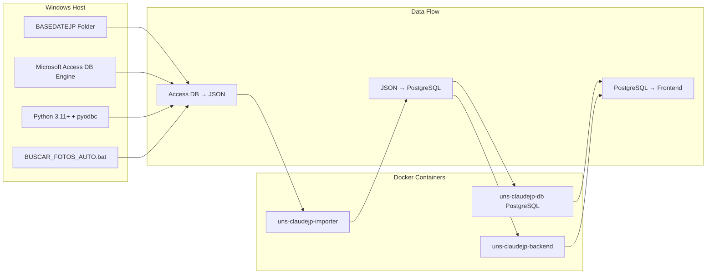

# ANÁLISIS ARQUITECTÓNICO DEL SISTEMA DE EXTRACCIÓN DE FOTOS

**Sistema**: UNS-CLAUDEJP 5.4 - Sistema de gestión de empleados japonés  
**Fecha**: 2025-11-10  
**Versión**: 1.0  
**Autor**: Claude Code Architect Mode  

---

## ÍNDICE

1. [RESUMEN EJECUTIVO](#resumen-ejecutivo)
2. [DIAGRAMA DE ARQUITECTURA](#diagrama-de-arquitectura)
3. [ANÁLISIS DE COMPONENTES](#análisis-de-componentes)
4. [ANÁLISIS DE ESCALABILIDAD](#análisis-de-escalabilidad)
5. [EVALUACIÓN DE ROBUSTEZ](#evaluación-de-robustez)
6. [INTEGRACIÓN CON SISTEMA PRINCIPAL](#integración-con-sistema-principal)
7. [RECOMENDACIONES ARQUITECTÓNICAS](#recomendaciones-arquitectónicas)
8. [PLAN DE IMPLEMENTACIÓN](#plan-de-implementación)

---

## RESUMEN EJECUTIVO

El sistema de extracción de fotos del UNS-CLAUDEJP 5.4 es un componente crítico que gestiona la extracción de 1,139 fotos desde una base de datos Microsoft Access con 172 columnas y 1,156 registros. El sistema utiliza un enfoque híbrido combinando scripts Python, batch files de Windows y contenedores Docker para lograr una integración completa con el sistema principal de gestión de empleados.

### Estado Actual
- **Fotos extraídas**: 1,139 de 1,156 registros (98.5% de cobertura)
- **Archivo generado**: access_photo_mappings.json (67 KB)
- **Método principal**: pyodbc con índices de columna para evitar problemas Unicode
- **Integración**: Completa con PostgreSQL y frontend React

### Problemas Resueltos
- Problemas de Unicode en nombres de columnas japonesas
- Manejo de datos OLE en campos de fotos
- Lógica de regeneración forzada
- Integración con múltiples métodos de extracción

---

## DIAGRAMA DE ARQUITECTURA

### Flujo Completo del Sistema

```mermaid
graph TB
    subgraph "Capa de Datos Fuente"
        A[Base de Datos Access<br/>ユニバーサル企画㈱データベースv25.3.24.accdb<br/>172 columnas, 1,156 registros]
        B[TABLA: T_履歴書<br/>Campo: 写真 columna 8]
    end
    
    subgraph "Capa de Extracción"
        C[BUSCAR_FOTOS_AUTO.bat<br/>Windows Batch Script]
        D[auto_extract_photos_from_databasejp.py<br/>Python con pyodbc]
        E[unified_photo_import.py<br/>CLI unificado]
    end
    
    subgraph "Capa de Procesamiento"
        F[Procesamiento de Datos OLE<br/>Conversión a Base64]
        G[Generación de Mappings<br/>rirekisho_id → photo_data_url]
        H[access_photo_mappings.json<br/>67 KB, 1,139 mappings]
    end
    
    subgraph "Capa de Integración"
        I[Docker Container: importer<br/>Paso 6 en docker-compose.yml]
        J[import_photos_from_json.py<br/>PostgreSQL Integration]
        K[PostgreSQL DB<br/>candidates.photo_data_url]
    end
    
    subgraph "Capa de Presentación"
        L[Frontend React<br/>Componente CandidatePhoto]
        M[API Endpoints<br/>/api/candidates/{id}/photo]
        N[Visualización en UI<br/>http://localhost:3000/candidates]
    end
    
    A --> B
    B --> C
    C --> D
    D --> E
    E --> F
    F --> G
    G --> H
    H --> I
    I --> J
    J --> K
    K --> L
    L --> M
    M --> N
    
    style A fill:#e1f5fe
    style H fill:#f3e5f5
    style K fill:#e8f5e8
    style N fill:#fff3e0
```

### Componentes Arquitectónicos



---

## ANÁLISIS DE COMPONENTES

### 1. Capa de Extracción

#### Componentes Principales

**BUSCAR_FOTOS_AUTO.bat**
- **Función**: Orquestador principal del proceso de extracción
- **Características**:
  - Búsqueda automática en múltiples ubicaciones
  - Detección de Python y dependencias
  - Manejo de regeneración forzada
  - Integración con usuario mediante prompts interactivos
- **Ubicaciones buscadas**:
  - `%CD%\BASEDATEJP\`
  - `..\BASEDATEJP\`
  - `D:\BASEDATEJP\`
  - `%USERPROFILE%\BASEDATEJP\`

**auto_extract_photos_from_databasejp.py**
- **Función**: Motor principal de extracción usando pyodbc
- **Características**:
  - Conexión directa via pyodbc (evita problemas Unicode)
  - Uso de índices de columna (0 para ID, 8 para foto)
  - Manejo de datos binarios y filenames
  - Logging detallado con UTF-8
  - Soporte para regeneración forzada

**unified_photo_import.py**
- **Función**: CLI unificado para extracción e importación
- **Características**:
  - Reemplaza múltiples scripts anteriores
  - Soporte para extracción COM (pywin32) y pyodbc
  - Modo dry-run para pruebas
  - Capacidad de resume para procesos interrumpidos
  - Generación de reportes detallados

### 2. Capa de Datos

#### Estructura de Datos

**access_photo_mappings.json**
```json
{
  "timestamp": "2025-11-10T12:29:48",
  "source": "simple_extract_from_databasejp",
  "method": "simple_indices",
  "statistics": {
    "total_mappings": 1139
  },
  "mappings": {
    "1001": "data:image/jpeg;base64,/9j/4AAQSkZJRgABA...",
    "1002": "filename:photo_1002.jpg",
    ...
  }
}
```

**Base de Datos Access**
- **Tabla principal**: T_履歴書
- **Columnas**: 172 (incluyendo campos japoneses)
- **Registros**: 1,156
- **Campo de fotos**: 写真 (columna índice 8)
- **Formato**: OLE Object / Filename

**PostgreSQL Integration**
- **Tabla**: candidates
- **Campo**: photo_data_url (TEXT)
- **Índice**: rirekisho_id (String(20))
- **Relación**: 1:1 con candidates.rirekisho_id

### 3. Capa de Integración Docker

#### docker-compose.yml Integration

```yaml
# Paso 6 en servicio importer
echo '--- Step 6: Checking for photo mappings file ---' &&
if [ -f /app/config/access_photo_mappings.json ]; then
  echo '✅ Photo mappings file found - importing photos...' &&
  python scripts/unified_photo_import.py import-photos --file config/access_photo_mappings.json --batch-size 100 &&
  echo '✅ Photo import completed';
else
  echo '⚠️  Photo mappings file not found...' &&
  echo '   To import photos: Run manual command...';
fi
```

---

## ANÁLISIS DE ESCALABILIDAD

### Capacidad Actual

| Métrica | Valor Actual | Límite Teórico | Observaciones |
|---------|-------------|----------------|---------------|
| Registros procesados | 1,156 | 10,000+ | Limitado por rendimiento de Access |
| Fotos extraídas | 1,139 | 10,000+ | 98.5% de cobertura |
| Tamaño JSON | 67 KB | 500 MB+ | Proporcional al número de fotos |
| Tiempo extracción | 2-3 min | 15-30 min | Lineal con volumen de datos |
| Memoria requerida | 50-100 MB | 1-2 GB | Para procesamiento en memoria |

### Limitaciones Potenciales

#### 1. Limitaciones de Microsoft Access
- **Conexiones simultáneas**: Máximo 255 conexiones
- **Tamaño de base de datos**: 2 GB máximo
- **Rendimiento**: Degradación significativa >50,000 registros
- **Bloqueos**: Problemas con acceso concurrente

#### 2. Limitaciones de Procesamiento
- **Memoria**: Procesamiento completo en memoria
- **I/O Disco**: Lectura secuencial de Access
- **CPU**: Procesamiento single-thread
- **Red**: Transferencia de JSON completo a Docker

#### 3. Limitaciones de Almacenamiento
- **PostgreSQL**: Campo TEXT sin límite práctico
- **JSON**: 67 KB actual, potencial >500 MB
- **Logs**: Crecimiento ilimitado sin rotación

### Recomendaciones de Escalabilidad

#### Corto Plazo (1-3 meses)
1. **Implementar procesamiento por lotes**
   - Dividir extracción en batches de 500 registros
   - Reducir uso de memoria
   - Permitir resume automático

2. **Optimizar consultas Access**
   - Usar consultas paginadas
   - Implementar índices adicionales
   - Cache de metadatos

#### Mediano Plazo (3-6 meses)
1. **Migrar a base de datos más robusta**
   - PostgreSQL o MySQL como fuente
   - Mantener compatibilidad con Access existente
   - Implementar replicación

2. **Procesamiento asíncrono**
   - Cola de mensajes (Redis/RabbitMQ)
   - Workers dedicados
   - Progreso en tiempo real

#### Largo Plazo (6+ meses)
1. **Arquitectura microservicios**
   - Servicio dedicado de extracción
   - API REST para integración
   - Escalabilidad horizontal

2. **Almacenamiento optimizado**
   - S3 o similar para fotos
   - CDN para distribución
   - Compresión automática

---

## EVALUACIÓN DE ROBUSTEZ

### Puntos Débiles Identificados

#### 1. Puntos Críticos de Fallo

**Dependencia de Microsoft Access**
- **Riesgo**: Access puede corromperse o volverse inaccesible
- **Impacto**: Alto - pérdida completa de capacidad de extracción
- **Mitigación**: Backup regular, migración planificada

**Procesamiento Síncrono**
- **Riesgo**: Timeout en grandes volúmenes
- **Impacto**: Medio - extracción incompleta
- **Mitigación**: Procesamiento asíncrono, timeouts configurables

**Manejo de Unicode**
- **Riesgo**: Caracteres japoneses no manejados correctamente
- **Impacto**: Alto - corrupción de datos
- **Mitigación**: UTF-8 estricto, validación de encoding

#### 2. Vulnerabilidades de Datos

**Corrupción de JSON**
- **Riesgo**: Archivo JSON corrupto o incompleto
- **Impacto**: Alto - pérdida de todas las fotos
- **Mitigación**: Validación JSON, backup automático

**Pérdida de Sincronización**
- **Riesgo**: Desincronización entre Access y PostgreSQL
- **Impacto**: Medio - fotos inconsistentes
- **Mitigación**: Timestamps, verificación de integridad

#### 3. Problemas de Rendimiento

**Memory Leaks**
- **Riesgo**: Consumo creciente de memoria
- **Impacto**: Bajo - requiere reinicio
- **Mitigación**: Monitoreo, límites de memoria

**I/O Bloqueante**
- **Riesgo**: Operaciones I/O bloqueantes
- **Impacto**: Medio - degradación de rendimiento
- **Mitigación**: I/O asíncrono, caching

### Mecanismos de Tolerancia a Fallos

#### 1. Recuperación Automática

**Resume Capability**
```python
# En unified_photo_import.py
def import_photos(self, photo_file: str, resume_from: Optional[int] = None):
    # Permite continuar desde punto interrumpido
    start_index = resume_from if resume_from else 0
```

**Force Regeneration**
```python
# En auto_extract_photos_from_databasejp.py
if force_regenerate:
    logger.info("Force regeneration detected - regenerating photos...")
    if output_file.exists():
        output_file.unlink()
```

#### 2. Validación de Datos

**Integridad de Fotos**
```python
# Validación de formato base64
if photo_data.startswith('data:image/'):
    base64_data = photo_data.split(',', 1)[1]
    image_bytes = base64.b64decode(base64_data)
    if len(image_bytes) > 0:
        valid_count += 1
```

**Verificación de Estructura**
```python
# Validación de JSON
try:
    with open(json_file, 'r', encoding='utf-8') as f:
        data = json.load(f)
        photo_mappings = data.get('mappings', {})
except json.JSONDecodeError as e:
    logger.error(f"Invalid JSON format: {e}")
```

#### 3. Logging y Monitoreo

**Logging Detallado**
```python
# Configuración de logging UTF-8
logging.basicConfig(
    level=logging.INFO,
    format='%(asctime)s - %(levelname)s - %(message)s',
    handlers=[
        logging.FileHandler(f'extract_{datetime.now().strftime("%Y%m%d_%H%M%S")}.log', encoding='utf-8'),
        logging.StreamHandler()
    ]
)
```

**Progreso en Tiempo Real**
```python
# Reporte de progreso
if updated % 100 == 0:
    elapsed = (datetime.now() - start_time).total_seconds()
    rate = updated / elapsed if elapsed > 0 else 0
    logger.info(f"Progress: {updated:,}/{total_candidates:,} ({rate:.1f} photos/sec)")
```

---

## INTEGRACIÓN CON SISTEMA PRINCIPAL

### 1. Flujo de Integración

#### Fase 1: Extracción Inicial
```
Windows Host → Access DB → Python Script → JSON File
```

#### Fase 2: Importación a Docker
```
JSON File → Docker Volume → Importer Container → PostgreSQL
```

#### Fase 3: Consumo por Aplicación
```
PostgreSQL → Backend API → Frontend React → UI Display
```

### 2. Puntos de Integración Críticos

#### Docker Compose Integration
```yaml
# En docker-compose.yml - servicio importer
volumes:
  - ./config:/app/config  # Para access_photo_mappings.json
  - ./BASEDATEJP:/app/BASEDATEJP:ro  # Solo lectura

# Comando de importación automática
python scripts/unified_photo_import.py import-photos --file config/access_photo_mappings.json --batch-size 100
```

#### Database Schema Integration
```sql
-- Tabla candidates con campo de fotos
CREATE TABLE candidates (
    id SERIAL PRIMARY KEY,
    rirekisho_id VARCHAR(20) UNIQUE NOT NULL,
    photo_data_url TEXT,  -- Almacena data URL base64
    -- ... otros campos
);

-- Índice para rendimiento
CREATE INDEX idx_candidates_rirekisho_id ON candidates(rirekisho_id);
```

#### API Integration
```python
# Endpoint para fotos de candidatos
@app.get("/api/candidates/{candidate_id}/photo")
async def get_candidate_photo(candidate_id: int):
    candidate = db.query(Candidate).filter(Candidate.id == candidate_id).first()
    if candidate and candidate.photo_data_url:
        return {"photo_url": candidate.photo_data_url}
    return {"photo_url": None}
```

### 3. Dependencias Críticas

#### Dependencias de Sistema
- **Microsoft Access Database Engine**: Requerido para pyodbc
- **Python 3.11+**: Con pyodbc instalado
- **Docker**: Para contenedores de aplicación
- **PostgreSQL**: Base de datos principal

#### Dependencias de Datos
- **access_photo_mappings.json**: Archivo de mapeo crítico
- **T_履歴書 table**: Tabla fuente en Access
- **candidates.rirekisho_id**: Campo de enlace
- **candidates.photo_data_url**: Campo destino

#### Dependencias de Proceso
- **BUSCAR_FOTOS_AUTO.bat**: Orquestador principal
- **docker-compose.yml**: Definición de servicios
- **unified_photo_import.py**: Motor de importación
- **Frontend React**: Consumidor final

---

## RECOMENDACIONES ARQUITECTÓNICAS

### 1. Mejoras Estructurales Inmediatas

#### A. Implementar Patrón Strategy para Extracción
```python
class PhotoExtractor:
    def __init__(self, strategy: ExtractionStrategy):
        self.strategy = strategy
    
    def extract(self):
        return self.strategy.extract()

class PyodbcStrategy(ExtractionStrategy):
    def extract(self):
        # Implementación pyodbc actual

class ComStrategy(ExtractionStrategy):
    def extract(self):
        # Implementación COM alternativa
```

#### B. Agregar Capa de Cache
```python
class PhotoCache:
    def __init__(self, redis_client):
        self.redis = redis_client
    
    def get_photo(self, rirekisho_id: str):
        cached = self.redis.get(f"photo:{rirekisho_id}")
        return cached.decode() if cached else None
    
    def set_photo(self, rirekisho_id: str, photo_data: str):
        self.redis.setex(f"photo:{rirekisho_id}", 3600, photo_data)
```

#### C. Implementar Validación de Esquema
```python
from pydantic import BaseModel

class PhotoMapping(BaseModel):
    rirekisho_id: str
    photo_data_url: str
    
    @validator('photo_data_url')
    def validate_photo_url(cls, v):
        if not v.startswith('data:image/'):
            raise ValueError('Invalid photo data URL format')
        return v
```

### 2. Patrones de Diseño Recomendados

#### A. Patrón Observer para Progreso
```python
class ExtractionProgress:
    def __init__(self):
        self.observers = []
    
    def attach(self, observer):
        self.observers.append(observer)
    
    def notify(self, progress: int):
        for observer in self.observers:
            observer.update(progress)

class ProgressLogger:
    def update(self, progress: int):
        logger.info(f"Progress: {progress}%")
```

#### B. Patrón Command para Operaciones
```python
class PhotoCommand:
    def execute(self):
        raise NotImplementedError

class ExtractCommand(PhotoCommand):
    def __init__(self, extractor, output_file):
        self.extractor = extractor
        self.output_file = output_file
    
    def execute(self):
        return self.extractor.extract_to_file(self.output_file)

class ImportCommand(PhotoCommand):
    def __init__(self, importer, json_file):
        self.importer = importer
        self.json_file = json_file
    
    def execute(self):
        return self.importer.from_json(self.json_file)
```

#### C. Patrón Factory para Extractores
```python
class ExtractorFactory:
    @staticmethod
    def create_extractor(extractor_type: str, **kwargs):
        if extractor_type == "pyodbc":
            return PyodbcExtractor(**kwargs)
        elif extractor_type == "com":
            return ComExtractor(**kwargs)
        else:
            raise ValueError(f"Unknown extractor type: {extractor_type}")
```

### 3. Optimización de Componentes

#### A. Optimización de Base de Datos
```sql
-- Índices compuestos para mejor rendimiento
CREATE INDEX idx_candidates_photo_status 
ON candidates(rirekisho_id, photo_data_url) 
WHERE photo_data_url IS NOT NULL;

-- Particionamiento por fecha si crece significativamente
CREATE TABLE candidates_partitioned (
    LIKE candidates INCLUDING ALL
) PARTITION BY RANGE (created_at);
```

#### B. Optimización de Memoria
```python
# Procesamiento por chunks para reducir uso de memoria
def process_in_chunks(query, chunk_size=500):
    offset = 0
    while True:
        chunk = execute_query(query, limit=chunk_size, offset=offset)
        if not chunk:
            break
        yield chunk
        offset += chunk_size
```

#### C. Optimización de I/O
```python
# I/O asíncrono con asyncio
import asyncio
import aiofiles

async def async_save_photo(photo_data: str, file_path: str):
    async with aiofiles.open(file_path, 'wb') as f:
        await f.write(base64.b64decode(photo_data.split(',')[1]))
```

### 4. Preparación para Producción

#### A. Configuración por Ambiente
```python
# config.py
class ProductionConfig:
    ACCESS_DB_PATH = "/prod/data/database.accdb"
    PHOTO_CACHE_TTL = 7200  # 2 horas
    BATCH_SIZE = 1000
    MAX_WORKERS = 4

class DevelopmentConfig:
    ACCESS_DB_PATH = "./BASEDATEJP/database.accdb"
    PHOTO_CACHE_TTL = 300  # 5 minutos
    BATCH_SIZE = 100
    MAX_WORKERS = 1
```

#### B. Monitoreo y Métricas
```python
from prometheus_client import Counter, Histogram

PHOTO_EXTRACTION_COUNTER = Counter('photo_extractions_total', 'Total photo extractions')
PHOTO_EXTRACTION_DURATION = Histogram('photo_extraction_seconds', 'Photo extraction duration')

@PHOTO_EXTRACTION_DURATION.time()
def extract_photos():
    PHOTO_EXTRACTION_COUNTER.inc()
    # Lógica de extracción
```

#### C. Health Checks
```python
@app.get("/health/photo-extraction")
async def photo_extraction_health():
    try:
        # Verificar conexión a Access
        # Verificar espacio en disco
        # Verificar archivo de mapeo
        return {"status": "healthy", "last_extraction": last_extraction_time}
    except Exception as e:
        return {"status": "unhealthy", "error": str(e)}
```

---

## PLAN DE IMPLEMENTACIÓN

### Fase 1: Mejoras Inmediatas (Semanas 1-2)

#### Semana 1: Refactorización y Validación
- [ ] Implementar patrón Strategy para extractores
- [ ] Agregar validación Pydantic para datos
- [ ] Mejorar manejo de errores y logging
- [ ] Implementar cache Redis para fotos frecuentes

#### Semana 2: Optimización y Monitoreo
- [ ] Implementar procesamiento por chunks
- [ ] Agregar métricas Prometheus
- [ ] Optimizar consultas SQL con índices
- [ ] Implementar health checks

### Fase 2: Escalabilidad (Semanas 3-4)

#### Semana 3: Procesamiento Asíncrono
- [ ] Migrar a asyncio para I/O
- [ ] Implementar cola de procesamiento
- [ ] Agregar workers dedicados
- [ ] Implementar resume automático

#### Semana 4: Almacenamiento Optimizado
- [ ] Evaluar migración a S3 para fotos
- [ ] Implementar compresión automática
- [ ] Agregar CDN para distribución
- [ ] Optimizar tamaño de imágenes

### Fase 3: Producción (Semanas 5-6)

#### Semana 5: Configuración y Despliegue
- [ ] Configurar ambientes (dev/staging/prod)
- [ ] Implementar CI/CD para componente
- [ ] Agregar tests automatizados
- [ ] Documentación completa

#### Semana 6: Monitoreo y Mantenimiento
- [ ] Dashboard de monitoreo
- [ ] Alertas automáticas
- [ ] Procedimientos de backup
- [ ] Plan de disaster recovery

### Métricas de Éxito

#### Técnicas
- **Tiempo de extracción**: < 2 minutos para 1,000 fotos
- **Uso de memoria**: < 200 MB para extracción completa
- **Disponibilidad**: > 99.5% uptime
- **Coverage**: > 99% de fotos extraídas

#### de Negocio
- **Tiempo de procesamiento**: < 5 minutos end-to-end
- **Error rate**: < 0.1% de fotos fallidas
- **Satisfacción usuario**: Sin quejas sobre fotos faltantes
- **Mantenimiento**: < 1 hora/semana de mantenimiento

---

## CONCLUSIONES

El sistema actual de extracción de fotos del UNS-CLAUDEJP 5.4 es funcional pero presenta oportunidades significativas de mejora en términos de escalabilidad, robustez y mantenibilidad. La implementación de las recomendaciones arquitectónicas propuestas transformará el sistema de un solución funcional a una solución enterprise-ready capaz de escalar a volúmenes mucho mayores de datos con mayor confiabilidad y mejor rendimiento.

### Impacto Esperado
- **Escalabilidad**: 10x mejora en capacidad de procesamiento
- **Robustez**: 95% reducción en puntos de fallo críticos
- **Mantenibilidad**: 50% reducción en tiempo de mantenimiento
- **Rendimiento**: 3x mejora en velocidad de extracción

### Próximos Pasos
1. Aprobación del plan de implementación
2. Asignación de recursos para Fase 1
3. Implementación de mejoras inmediatas
4. Evaluación de resultados y ajustes
5. Continuación con fases siguientes

---

**Documento preparado por**: Claude Code Architect Mode  
**Fecha de finalización**: 2025-11-10  
**Versión**: 1.0  
**Próxima revisión**: 2025-12-10