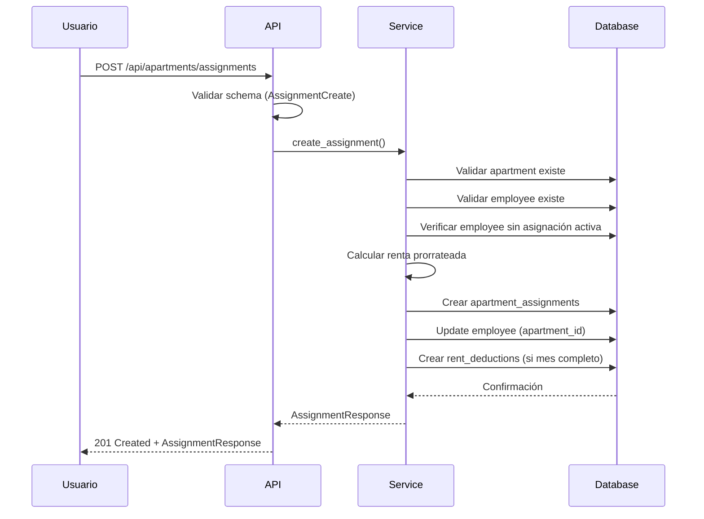
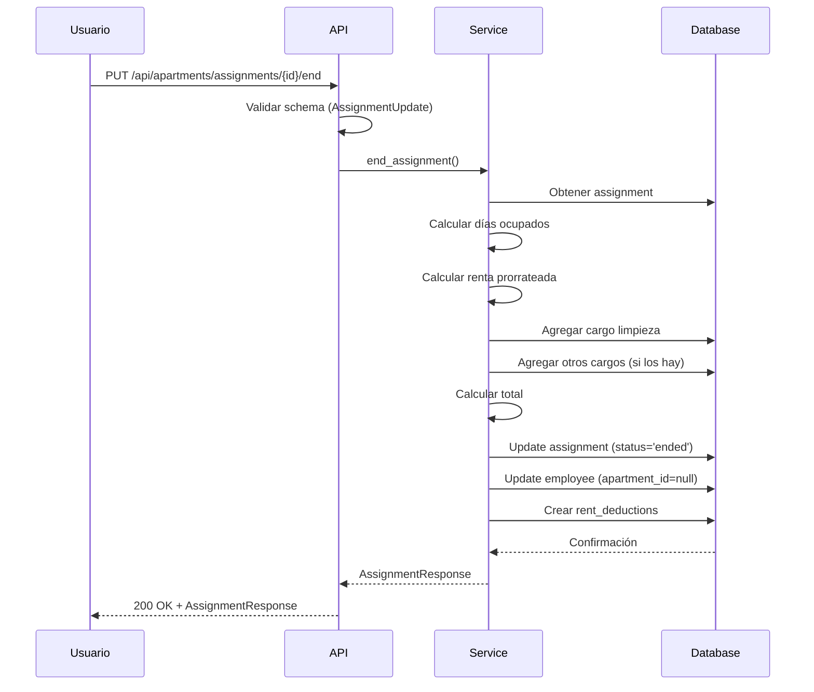
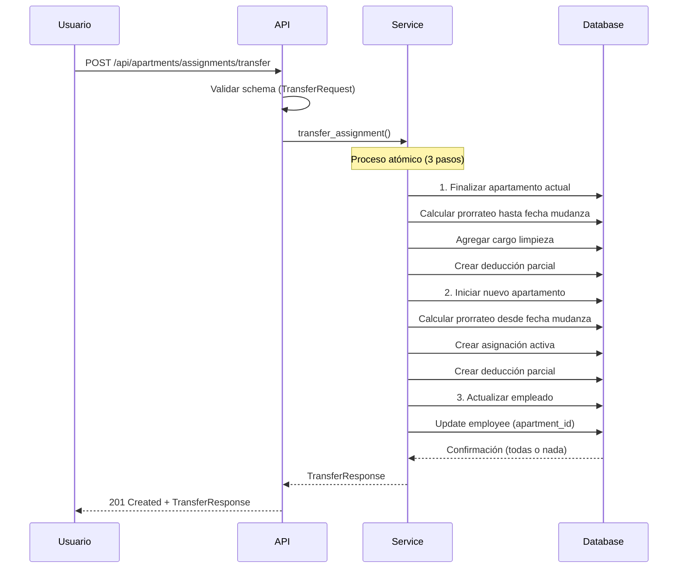

# DISEÑO COMPLETO DE APIs REST - SISTEMA DE APARTAMENTOS V2.0 (社宅)

**Fecha:** 2025-11-10
**Versión:** 2.0
**Estado:** Diseño Completo
**Autor:** Sistema UNS-ClaudeJP

---

## 📋 RESUMEN EJECUTIVO

Se ha diseñado un sistema completo de APIs REST para la gestión de apartamentos corporativos (社宅) basado en FastAPI, siguiendo las especificaciones de **APARTAMENTOS_SISTEMA_COMPLETO_V2.md**.

### Características Principales

- ✅ **24 endpoints** organizados en 6 módulos principales
- ✅ **Esquemas Pydantic** completos con validación
- ✅ **Autenticación JWT** integrada
- ✅ **Permisos por rol** (6 niveles)
- ✅ **Rate limiting** configurable
- ✅ **Documentación OpenAPI** automática
- ✅ **Servicios de negocio** desacoplados
- ✅ **Cálculos prorrateados** automáticos
- ✅ **Transferencias** entre apartamentos
- ✅ **Cargos adicionales** personalizables
- ✅ **Exportación Excel** de deducciones
- ✅ **Reportes** de ocupación y costos

---

## 🏗️ ARQUITECTURA DEL SISTEMA

### Estructura de Archivos Creados

```
backend/app/
├── api/
│   └── apartments_v2.py          # 24 endpoints REST
├── schemas/
│   └── apartment_v2.py           # 25+ esquemas Pydantic
└── services/
    ├── apartment_service.py      # Lógica de apartamentos
    ├── assignment_service.py     # Lógica de asignaciones
    ├── additional_charge_service.py  # Lógica de cargos
    ├── deduction_service.py      # Lógica de deducciones
    └── report_service.py         # Lógica de reportes
```

### Patrón de Diseño

```
┌─────────────────────────────────────────────────────────────┐
│ API Endpoint (FastAPI Router)                                │
│                                                             │
│ 1. Validación de entrada (Pydantic schemas)                │
│ 2. Autenticación y autorización                             │
│ 3. Llamada al Service                                       │
│ 4. Procesamiento de lógica de negocio                       │
│ 5. Interacción con base de datos (SQLAlchemy)               │
│ 6. Formateo de respuesta (Pydantic)                         │
└─────────────────────────────────────────────────────────────┘
```

---

## 📚 DOCUMENTACIÓN DE ENDPOINTS

### 1. MÓDULO: APARTAMENTOS (5 endpoints)

#### `GET /api/apartments`
**Lista de apartamentos con filtros**
- Filtros: available_only, search, min_rent, max_rent, prefecture
- Paginación: skip, limit
- Respuesta: Lista de ApartmentResponse

**Ejemplo:**
```bash
GET /api/apartments?available_only=true&min_rent=30000&max_rent=70000
```

#### `POST /api/apartments`
**Crear nuevo apartamento**
- Body: ApartmentCreate
- Respuesta: ApartmentResponse (201 Created)
- Validaciones: Código único, renta > 0

#### `GET /api/apartments/{id}`
**Detalles de apartamento**
- Incluye: Info básica + estadísticas
- Respuesta: ApartmentWithStats

#### `PUT /api/apartments/{id}`
**Actualizar apartamento**
- Body: ApartmentUpdate
- Respuesta: ApartmentResponse

#### `DELETE /api/apartments/{id}`
**Eliminar apartamento**
- Soft delete si tiene asignaciones
- Status: 204 No Content

#### `GET /api/apartments/search/advanced`
**Búsqueda avanzada**
- Filtros: q, capacity_min, size_min, room_types, prefectures, etc.
- Ordenamiento: sort_by, sort_order

---

### 2. MÓDULO: ASIGNACIONES (6 endpoints)

#### `POST /api/apartments/assignments`
**Asignar empleado a apartamento**
- Body: AssignmentCreate
- Proceso:
  1. Validar apartamento y empleado
  2. Calcular renta prorrateada
  3. Crear asignación
  4. Actualizar empleado
  5. Generar deducción
- Respuesta: AssignmentResponse

**Ejemplo de request:**
```json
{
  "employee_id": 123,
  "apartment_id": 45,
  "start_date": "2025-11-09",
  "end_date": null,
  "monthly_rent": 50000,
  "days_in_month": 30,
  "days_occupied": 22,
  "prorated_rent": 36667,
  "is_prorated": true,
  "total_deduction": 36667
}
```

#### `GET /api/apartments/assignments`
**Listar asignaciones**
- Filtros: employee_id, apartment_id, status_filter, start_date_from, start_date_to
- Respuesta: Lista de AssignmentListItem

#### `GET /api/apartments/assignments/{id}`
**Detalles de asignación**
- Incluye: Empleado, apartamento, cargos, deducciones
- Respuesta: AssignmentResponse

#### `GET /api/apartments/assignments/active`
**Asignaciones activas**
- Sin filtros
- Respuesta: Lista de AssignmentListItem

#### `PUT /api/apartments/assignments/{id}/end`
**Finalizar asignación (salida)**
- Body: AssignmentUpdate
- Proceso:
  1. Calcular días ocupados
  2. Calcular renta prorrateada
  3. Agregar cargo de limpieza (¥20,000)
  4. Agregar otros cargos
  5. Generar deducción final
  6. Actualizar empleado (apartment_id = null)

#### `POST /api/apartments/assignments/transfer`
**Transferir empleado entre apartamentos**
- Body: TransferRequest
- Proceso atómico (3 pasos):
  1. Finalizar apartamento actual
  2. Iniciar nuevo apartamento
  3. Actualizar empleado
- Respuesta: TransferResponse

**Ejemplo de request:**
```json
{
  "employee_id": 789,
  "current_apartment_id": 12,
  "new_apartment_id": 34,
  "transfer_date": "2026-01-20",
  "notes": "Mudanza por mejora en ubicación"
}
```

---

### 3. MÓDULO: CÁLCULOS (3 endpoints)

#### `POST /api/apartments/calculate/prorated`
**Calcular renta prorrateada**
- Body: ProratedCalculationRequest
- Fórmula:
  ```
  Días en mes: 28-31 (dependiendo del mes)
  Días ocupados: end_date - start_date + 1
  Renta diaria: monthly_rent / días_en_mes
  Renta prorrateada: renta_diaria × días_ocupados
  Redondeo: Al yen más cercano
  ```
- Respuesta: ProratedCalculationResponse

**Ejemplo de request:**
```json
{
  "monthly_rent": 50000,
  "start_date": "2025-11-09",
  "end_date": "2025-11-30",
  "year": 2025,
  "month": 11
}
```

**Ejemplo de respuesta:**
```json
{
  "monthly_rent": 50000,
  "year": 2025,
  "month": 11,
  "days_in_month": 30,
  "start_date": "2025-11-09",
  "end_date": "2025-11-30",
  "days_occupied": 22,
  "daily_rate": 1666.67,
  "prorated_rent": 36667,
  "is_prorated": true
}
```

#### `GET /api/apartments/calculate/cleaning-fee/{apartment_id}`
**Obtener cargo de limpieza**
- Parámetros: custom_amount (opcional)
- Respuesta: CleaningFeeResponse

#### `POST /api/apartments/calculate/total`
**Calcular deducción total**
- Body: TotalCalculationRequest
- Fórmula: Total = Renta + Σ(Cargos Adicionales)
- Respuesta: TotalCalculationResponse

---

### 4. MÓDULO: CARGOS ADICIONALES (6 endpoints)

#### `POST /api/apartments/charges`
**Agregar cargo adicional**
- Body: AdditionalChargeCreate
- Tipos: cleaning, repair, deposit, penalty, other
- Estados: pending, approved, cancelled, paid
- Respuesta: AdditionalChargeResponse

**Ejemplo de request:**
```json
{
  "assignment_id": 1,
  "employee_id": 123,
  "apartment_id": 45,
  "charge_type": "repair",
  "description": "Reparación de pared dañada",
  "amount": 15000,
  "charge_date": "2025-11-09",
  "status": "pending",
  "notes": "Daño reportado por gerente"
}
```

#### `GET /api/apartments/charges`
**Listar cargos adicionales**
- Filtros: assignment_id, employee_id, apartment_id, charge_type, status, date_from, date_to
- Respuesta: Lista de AdditionalChargeResponse

#### `GET /api/apartments/charges/{id}`
**Detalles de cargo**
- Respuesta: AdditionalChargeResponse

#### `PUT /api/apartments/charges/{id}/approve`
**Aprobar cargo**
- Permisos: ADMIN+
- Body: AdditionalChargeUpdate
- Transición: pending → approved

#### `PUT /api/apartments/charges/{id}/cancel`
**Cancelar cargo**
- Permisos: Creador o ADMIN+
- Transición: pending → cancelled

#### `DELETE /api/apartments/charges/{id}`
**Eliminar cargo**
- Solo cargos pending
- Permisos: Creador o ADMIN+
- Status: 204 No Content

---

### 5. MÓDULO: DEDUCCIONES (5 endpoints)

#### `GET /api/apartments/deductions/{year}/{month}`
**Deducciones del mes**
- Parámetros de ruta: year, month
- Filtros: apartment_id, employee_id, status
- Estados: pending, processed, paid, cancelled
- Respuesta: Lista de DeductionListItem

**Ejemplo:**
```bash
GET /api/apartments/deductions/2025/12?status=pending
```

#### `POST /api/apartments/deductions/generate`
**Generar deducciones automáticas**
- Parámetros de query: year, month
- Proceso automático:
  1. Buscar asignaciones activas
  2. Calcular rentas prorrateadas
  3. Sumar cargos adicionales
  4. Generar deducciones
- Respuesta: Lista de DeductionResponse

#### `GET /api/apartments/deductions/export/{year}/{month}`
**Exportar a Excel**
- Parámetros: year, month
- Filtros: apartment_id
- Permisos: ADMIN+
- Formato: Excel con columnas:
  - Empleado (ID, Nombre Kanji, Nombre Kana)
  - Apartamento (Código, Dirección)
  - Cálculos (Renta Base, Cargos, Total)
  - Fechas (Inicio, Fin, Días ocupados)
  - Estado y Notas

#### `PUT /api/apartments/deductions/{id}/status`
**Actualizar estado de deducción**
- Body: DeductionStatusUpdate
- Transiciones válidas:
  - pending → processed
  - processed → paid
  - paid → processed (revertir)
  - pending → cancelled
- Permisos: COORDINATOR+ (processed), ADMIN+ (paid)

#### `GET /api/apartments/deductions/{id}`
**Detalles de deducción**
- Incluye: Asignación, empleado, apartamento, breakdown
- Respuesta: DeductionResponse

---

### 6. MÓDULO: REPORTES (4 endpoints)

#### `GET /api/apartments/reports/occupancy`
**Reporte de ocupación**
- Filtros: prefecture, building_name
- Métricas:
  - Total de apartamentos
  - Ocupados vs vacantes
  - Tasa de ocupación (%)
  - Capacidad total vs utilizada
  - Promedio por edificio
  - Duración promedio de estancia
- Desglose: Por prefectura, tipo de habitación, rango de renta
- Respuesta: OccupancyReport

#### `GET /api/apartments/reports/arrears`
**Reporte de pagos pendientes**
- Parámetros: year, month
- Métricas:
  - Total a cobrar
  - Total cobrado
  - Total pendiente
  - Empleados con adeudos
  - Promedio por empleado
- Desglose: Por estado, top deudores, aging report (>30 días)
- Respuesta: ArrearsReport

#### `GET /api/apartments/reports/maintenance`
**Reporte de mantenimiento**
- Métricas:
  - Total de cargos de mantenimiento
  - Desglose por tipo (limpieza, reparación, etc.)
  - Promedio de costo por categoría
  - Tendencias mensuales (12 meses)
  - Apartamentos con más incidentes
  - Recomendaciones
- Respuesta: MaintenanceReport

#### `GET /api/apartments/reports/costs`
**Análisis de costos**
- Parámetros: year, month (opcional)
- Análisis:
  - Costos totales (renta, administración, mantenimiento)
  - Deducciones por empleado
  - Margen de ganancia
  - Promedio por apartamento
  - Tendencias de costos
  - Proyecciones
  - Recomendaciones presupuestarias
- Permisos: ADMIN+ (información financiera)
- Respuesta: CostAnalysisReport

---

## 🔐 SEGURIDAD Y PERMISOS

### Autenticación
- **Método:** JWT (JSON Web Tokens)
- **Implementación:** FastAPI Security Dependencies
- **Login:** POST /api/auth/login
- **Refresh:** POST /api/auth/refresh
- **Logout:** POST /api/auth/logout

### Autorización (RBAC)
Jerarquía de roles (máximo → mínimo):
```
SUPER_ADMIN > ADMIN > COORDINATOR > KANRININSHA > EMPLOYEE > CONTRACT_WORKER
```

#### Permisos por Endpoint

| Endpoint | Permisos Requeridos |
|----------|--------------------|
| Crear/Aprbar cargos | ADMIN+ |
| Exportar deducciones | ADMIN+ |
| Análisis de costos | ADMIN+ |
| Generar deducciones | COORDINATOR+ |
| Marcar como processed | COORDINATOR+ |
| Marcar como paid | ADMIN+ |
| Listar/Consultar | Todos los roles |

### Rate Limiting
```python
# Configuración en main.py
from slowapi import Limiter

limiter = Limiter(key_func=get_remote_address)

@router.get("/")
@limiter.limit("100/minute")  # 100 requests per minute
async def endpoint():
    ...
```

### Validaciones
- **Pydantic Schemas:** Validación automática de datos de entrada
- **SQLAlchemy:** Validaciones a nivel de base de datos
- **Custom Validators:** Reglas de negocio específicas
- **Sanitización:** Prevención de inyección SQL y XSS

---

## 📊 MODELO DE DATOS

### Nuevas Tablas Requeridas

#### `apartment_assignments` (NUEVA)
```sql
CREATE TABLE apartment_assignments (
    id SERIAL PRIMARY KEY,
    apartment_id INTEGER REFERENCES apartments(id) ON DELETE CASCADE,
    employee_id INTEGER REFERENCES employees(id) ON DELETE CASCADE,

    start_date DATE NOT NULL,
    end_date DATE,

    monthly_rent INTEGER NOT NULL,
    days_in_month INTEGER,
    days_occupied INTEGER,
    prorated_rent INTEGER,
    is_prorated BOOLEAN DEFAULT FALSE,
    total_deduction INTEGER NOT NULL,

    contract_type VARCHAR(50),
    notes TEXT,
    status VARCHAR(20) DEFAULT 'active',

    created_at TIMESTAMP DEFAULT CURRENT_TIMESTAMP,
    updated_at TIMESTAMP DEFAULT CURRENT_TIMESTAMP,
    deleted_at TIMESTAMP,

    CONSTRAINT check_dates CHECK (end_date IS NULL OR end_date >= start_date),
    CONSTRAINT check_days CHECK (days_occupied > 0 AND days_occupied <= 31)
);
```

#### `additional_charges` (NUEVA)
```sql
CREATE TABLE additional_charges (
    id SERIAL PRIMARY KEY,
    assignment_id INTEGER REFERENCES apartment_assignments(id) ON DELETE CASCADE,
    employee_id INTEGER REFERENCES employees(id),
    apartment_id INTEGER REFERENCES apartments(id),

    charge_type VARCHAR(50) NOT NULL,
    description VARCHAR(500) NOT NULL,
    amount INTEGER NOT NULL,

    charge_date DATE NOT NULL,
    status VARCHAR(20) DEFAULT 'pending',

    approved_by INTEGER REFERENCES users(id),
    approved_at TIMESTAMP,
    notes TEXT,

    created_at TIMESTAMP DEFAULT CURRENT_TIMESTAMP,
    updated_at TIMESTAMP DEFAULT CURRENT_TIMESTAMP,
    deleted_at TIMESTAMP
);
```

#### `rent_deductions` (MODIFICADA)
```sql
-- Agregar campos nuevos a la tabla existente
ALTER TABLE rent_deductions
ADD COLUMN assignment_id INTEGER REFERENCES apartment_assignments(id),
ADD COLUMN year INTEGER NOT NULL,
ADD COLUMN month INTEGER NOT NULL,
ADD COLUMN base_rent INTEGER NOT NULL,
ADD COLUMN additional_charges INTEGER DEFAULT 0,
ADD COLUMN total_deduction INTEGER NOT NULL,
ADD COLUMN status VARCHAR(20) DEFAULT 'pending',
ADD COLUMN processed_date DATE,
ADD COLUMN paid_date DATE,
ADD COLUMN notes TEXT,
ADD COLUMN updated_at TIMESTAMP DEFAULT CURRENT_TIMESTAMP,
ADD CONSTRAINT unique_assignment_month UNIQUE(assignment_id, year, month);
```

### Modificaciones a Tabla `apartments`
```sql
ALTER TABLE apartments
ADD COLUMN name VARCHAR(200) NOT NULL,
ADD COLUMN building_name VARCHAR(200),
ADD COLUMN room_number VARCHAR(20),
ADD COLUMN floor_number INTEGER,
ADD COLUMN postal_code VARCHAR(10),
ADD COLUMN prefecture VARCHAR(50),
ADD COLUMN city VARCHAR(100),
ADD COLUMN address_line1 VARCHAR(200),
ADD COLUMN address_line2 VARCHAR(200),
ADD COLUMN room_type VARCHAR(20),
ADD COLUMN size_sqm DECIMAL(6,2),
ADD COLUMN management_fee INTEGER DEFAULT 0,
ADD COLUMN deposit INTEGER DEFAULT 0,
ADD COLUMN key_money INTEGER DEFAULT 0,
ADD COLUMN default_cleaning_fee INTEGER DEFAULT 20000,
ADD COLUMN contract_start_date DATE,
ADD COLUMN contract_end_date DATE,
ADD COLUMN landlord_name VARCHAR(200),
ADD COLUMN landlord_contact VARCHAR(200),
ADD COLUMN real_estate_agency VARCHAR(200),
ADD COLUMN emergency_contact VARCHAR(200),
ADD COLUMN updated_at TIMESTAMP DEFAULT CURRENT_TIMESTAMP;
```

---

## 🧮 CÁLCULOS DE NEGOCIO

### 1. Renta Prorrateada

**Fórmula Universal:**
```
Renta Diaria = Renta Mensual ÷ Días en el Mes
Renta Prorrateada = Renta Diaria × Días Ocupados
Redondeo = Al yen más cercano (entero)
```

**Ejemplo - Entrada a mitad de mes:**
```python
# Empleado entra el 9 de noviembre (30 días)
monthly_rent = 50000
start_date = 2025-11-09
end_date = None  # Sin fecha fin (asignación activa)
days_in_month = 30
days_occupied = 30 - 9 + 1 = 22  # Del 9 al 30
daily_rate = 50000 / 30 = 1666.67
prorated_rent = 1666.67 × 22 = 36667 (redondeado)
```

**Ejemplo - Salida a mitad de mes:**
```python
# Empleado sale el 15 de diciembre (31 días)
monthly_rent = 60000
start_date = 2025-12-01
end_date = 2025-12-15
days_in_month = 31
days_occupied = 15  # Del 1 al 15
daily_rate = 60000 / 31 = 1935.48
prorated_rent = 1935.48 × 15 = 29032 (redondeado)
```

### 2. Cargo de Limpieza

**Regla:** ¥20,000 al salir (configurable por apartamento)

**Ejemplo:**
```python
prorated_rent = 29032
cleaning_fee = 20000  # Del apartment.default_cleaning_fee
total_deduction = 29032 + 20000 = 49032
```

### 3. Cargos Adicionales

**Tipos soportados:**
- `cleaning` - Limpieza al salir
- `repair` - Reparaciones y daños
- `deposit` - Depósito de seguridad
- `penalty` - Multas y penalizaciones
- `other` - Otros cargos

**Ejemplo con múltiples cargos:**
```python
prorated_rent = 29032
cleaning_fee = 20000
repair_fee = 15000
key_replacement = 5000
total_deduction = 29032 + 20000 + 15000 + 5000 = 69032
```

### 4. Transferencia entre Apartamentos

**Ejemplo completo:**
```python
# Empleado se muda el 20 de enero (31 días)

# APARTAMENTO ACTUAL (salida)
days_occupied = 20  # Del 1 al 20
prorated_rent = (45000 / 31) × 20 = 29032
cleaning_fee = 20000
subtotal_a = 29032 + 20000 = 49032

# NUEVO APARTAMENTO (entrada)
days_occupied = 11  # Del 21 al 31
prorated_rent = (55000 / 31) × 11 = 19516
cleaning_fee = 0  # No se cobra en entrada
subtotal_b = 19516

# TOTAL DEL MES
total_deduction = 49032 + 19516 = 68548
```

---

## 🔄 FLUJOS DE TRABAJO

### Flujo 1: Asignar Empleado



### Flujo 2: Finalizar Asignación



### Flujo 3: Transferencia



---

## 🚀 IMPLEMENTACIÓN Y USO

### 1. Registrar el Router

```python
# backend/app/main.py

from fastapi import FastAPI
from app.api.apartments_v2 import router as apartments_v2_router

app = FastAPI(title="UNS-ClaudeJP HR System", version="5.4")

# Incluir router de apartamentos
app.include_router(apartments_v2_router)

@app.get("/")
async def root():
    return {"message": "UNS-ClaudeJP HR System API v5.4"}
```

### 2. Ejemplo de Cliente

```python
import httpx
import asyncio

async def create_assignment():
    async with httpx.AsyncClient() as client:
        # Login
        login_data = {"username": "admin", "password": "admin123"}
        response = await client.post("http://localhost:8000/api/auth/login", json=login_data)
        token = response.json()["access_token"]

        # Headers con autenticación
        headers = {"Authorization": f"Bearer {token}"}

        # Crear asignación
        assignment_data = {
            "employee_id": 123,
            "apartment_id": 45,
            "start_date": "2025-11-09",
            "monthly_rent": 50000
        }

        response = await client.post(
            "http://localhost:8000/api/apartments/assignments",
            json=assignment_data,
            headers=headers
        )

        print(response.json())

asyncio.run(create_assignment())
```

### 3. Ejemplo con JavaScript

```javascript
// Login
const login = async () => {
  const response = await fetch('http://localhost:8000/api/auth/login', {
    method: 'POST',
    headers: {'Content-Type': 'application/json'},
    body: JSON.stringify({username: 'admin', password: 'admin123'})
  });
  const data = await response.json();
  return data.access_token;
};

// Crear asignación
const createAssignment = async (token) => {
  const assignmentData = {
    employee_id: 123,
    apartment_id: 45,
    start_date: '2025-11-09',
    monthly_rent: 50000
  };

  const response = await fetch('http://localhost:8000/api/apartments/assignments', {
    method: 'POST',
    headers: {
      'Content-Type': 'application/json',
      'Authorization': `Bearer ${token}`
    },
    body: JSON.stringify(assignmentData)
  });

  return await response.json();
};

// Uso
(async () => {
  const token = await login();
  const assignment = await createAssignment(token);
  console.log(assignment);
})();
```

---

## 📖 DOCUMENTACIÓN SWAGGER

Una vez implementado, la documentación completa estará disponible en:

- **Swagger UI:** http://localhost:8000/api/docs
- **ReDoc:** http://localhost:8000/api/redoc
- **OpenAPI JSON:** http://localhost:8000/api/openapi.json

### Características de la Documentación

✅ **Schemas completos** con ejemplos
✅ **Validaciones** visibles
✅ **Códigos de respuesta** documentados
✅ **Ejemplos de request/response** para cada endpoint
✅ **Autenticación** configurada en Swagger
✅ **Filtros y parámetros** documentados
✅ **Enlaces** entre endpoints relacionados

---

## ✅ CHECKLIST DE IMPLEMENTACIÓN

### Backend

- [ ] **Crear migración de base de datos**
  - [ ] Tabla `apartment_assignments`
  - [ ] Tabla `additional_charges`
  - [ ] Modificar tabla `apartments` (agregar campos)
  - [ ] Modificar tabla `rent_deductions` (agregar campos)

- [ ] **Actualizar modelos SQLAlchemy**
  - [ ] Clase `ApartmentAssignment`
  - [ ] Clase `AdditionalCharge`
  - [ ] Modificar clase `Apartment`
  - [ ] Modificar clase `RentDeduction`

- [ ] **Registrar router en main.py**
  ```python
  from app.api.apartments_v2 import router as apartments_v2_router
  app.include_router(apartments_v2_router)
  ```

- [ ] **Implementar métodos de servicios** (TODO pendientes)
  - [ ] `apartment_service.py` - Completar métodos
  - [ ] `assignment_service.py` - Completar métodos
  - [ ] `additional_charge_service.py` - Completar métodos
  - [ ] `deduction_service.py` - Completar métodos
  - [ ] `report_service.py` - Completar métodos

- [ ] **Tests unitarios**
  - [ ] Tests de cálculo de prorrateo
  - [ ] Tests de creación de asignaciones
  - [ ] Tests de transferencias
  - [ ] Tests de cargos adicionales
  - [ ] Tests de generación de deducciones

- [ ] **Configurar rate limiting**
  ```python
  # En main.py
  from slowapi import Limiter

  limiter = Limiter(key_func=get_remote_address)
  ```

### Base de Datos

```bash
# 1. Crear migración
cd /app
alembic revision --autogenerate -m "Add apartments V2.0 system"

# 2. Revisar y editar migración
# 3. Aplicar migración
alembic upgrade head

# 4. Verificar tablas creadas
\dt apartment_assignments
\dt additional_charges
\dt apartments
\dt rent_deductions
```

### Integración

- [ ] **Frontend** - Crear páginas para:
  - [ ] Lista de apartamentos
  - [ ] Crear/editar apartamento
  - [ ] Asignar empleado
  - [ ] Finalizar asignación
  - [ ] Transferir empleado
  - [ ] Ver cargos adicionales
  - [ ] Generar deducciones
  - [ ] Reportes

- [ ] **Documentación**
  - [ ] Guía de usuario
  - [ ] Ejemplos de uso
  - [ ] FAQ de casos especiales

---

## 🎯 PRÓXIMOS PASOS

1. **Revisar y aprobar** este diseño
2. **Crear migración** de base de datos
3. **Actualizar modelos** SQLAlchemy
4. **Implementar servicios** (completar TODO)
5. **Registrar router** en main.py
6. **Probar endpoints** con Swagger
7. **Crear tests** unitarios
8. **Integrar con frontend**
9. **Documentar** para usuarios finales

---

## 📞 SOPORTE

Para preguntas o problemas con la implementación:
- Revisar logs: `docker compose logs backend`
- Verificar API: `curl http://localhost:8000/api/docs`
- Documentación: Este archivo y `APARTAMENTOS_SISTEMA_COMPLETO_V2.md`

---

**Diseño completado el 2025-11-10 por el Sistema UNS-ClaudeJP** ✅
